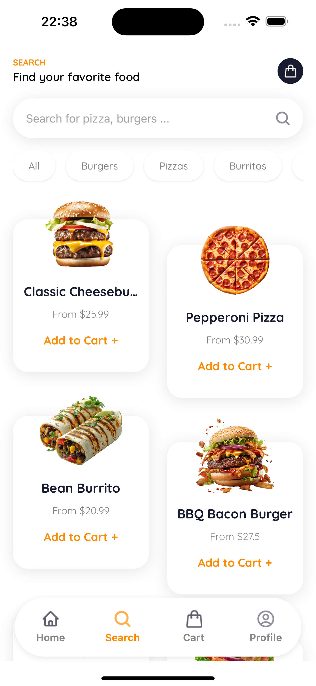

# 🍔 Fast Food App

A modern food ordering mobile application built with React Native and Expo. Users can browse menu items, customize orders, manage delivery addresses, and place food orders seamlessly.

## 🖼️ Screenshots

<div align="center">
  
  
  
  
</div>

<div align="center">
  
  
  
  
</div>

## 📱 Features

- **Authentication**: Sign up, sign in, and secure user sessions
- **Menu Browsing**: View categorized food items with ratings and nutritional info
- **Search & Filter**: Find specific menu items quickly
- **Shopping Cart**: Add items with customizations and manage quantities
- **Address Management**: Add, edit, and manage multiple delivery addresses
- **User Profile**: Manage personal information and preferences
- **Responsive Design**: Optimized for both iOS and Android

## 🛠️ Tech Stack

- **Framework**: React Native with Expo
- **Navigation**: Expo Router (file-based routing)
- **Styling**: NativeWind (Tailwind CSS for React Native)
- **Backend**: Appwrite (Database, Auth, Storage)
- **State Management**: Zustand
- **UI Components**: Custom components with consistent design system
- **TypeScript**: Full type safety throughout the application

## 🚀 Getting Started

### Prerequisites

- Node.js (v18 or later)
- npm or yarn
- Expo CLI
- iOS Simulator or Android Emulator (optional)

### Installation

1. **Clone the repository**
   ```bash
   git clone https://github.com/AdylshaY/food-ordering-app.git
   cd fast_food_app
   ```

2. **Install dependencies**
   ```bash
   npm install
   ```

3. **Set up environment variables**
   Create a `.env` file in the root directory and add your Appwrite configuration:
   ```env
   EXPO_PUBLIC_APPWRITE_ENDPOINT=your_appwrite_endpoint
   EXPO_PUBLIC_APPWRITE_PROJECT_ID=your_project_id
   EXPO_PUBLIC_DATABASE_ID=your_database_id
   EXPO_PUBLIC_USER_COLLECTION_ID=your_user_collection_id
   EXPO_PUBLIC_MENU_COLLECTION_ID=your_menu_collection_id
   EXPO_PUBLIC_CATEGORY_COLLECTION_ID=your_category_collection_id
   EXPO_PUBLIC_ADDRESS_COLLECTION_ID=your_address_collection_id
   EXPO_PUBLIC_BUCKET_ID=your_bucket_id
   EXPO_PUBLIC_PLATFORM=your_platform_name
   ```

4. **Start the development server**
   ```bash
   npx expo start
   ```

### Running the App

- **iOS Simulator**: Press `i` in the terminal or scan QR code with Expo Go
- **Android Emulator**: Press `a` in the terminal or scan QR code with Expo Go
- **Physical Device**: Install Expo Go and scan the QR code

## 📁 Project Structure

```
app/
├── (auth)/           # Authentication screens
├── (tabs)/           # Main tab navigation screens
├── address-form.tsx  # Address add/edit form
├── addresses.tsx     # Address management
└── _layout.tsx       # Root layout

components/           # Reusable UI components
├── AddressCard.tsx
├── CustomButton.tsx
├── CustomHeader.tsx
├── CustomInput.tsx
├── MenuCard.tsx
└── ...

docs/                 # Documentation
└── screenshots/      # App screenshots for README

lib/                  # Utilities and configurations
├── appwrite.ts       # Backend API functions
├── useAppwrite.ts    # Custom hook for API calls
└── utils.ts          # Helper functions

store/                # State management
├── auth.store.ts     # Authentication state
└── cart.store.ts     # Shopping cart state
```

## 🗄️ Database Schema

The app uses Appwrite with the following collections:

- **Users**: User profiles with authentication data
- **Menu**: Food items with categories and customizations
- **Categories**: Food categories for organization
- **Addresses**: User delivery addresses
- **Customizations**: Available food customization options

## 🎨 Design System

- **Typography**: Quicksand font family with defined text styles
- **Colors**: Custom color palette with primary orange theme
- **Components**: Reusable components following consistent design patterns
- **Responsive**: Optimized for various screen sizes

## 📄 Scripts

- `npm start` - Start the development server
- `npm run android` - Start on Android emulator
- `npm run ios` - Start on iOS simulator
- `npm run web` - Start web version
- `npm run lint` - Run ESLint

## 🤝 Contributing

1. Fork the repository
2. Create a feature branch (`git checkout -b feature/amazing-feature`)
3. Commit your changes (`git commit -m 'Add amazing feature'`)
4. Push to the branch (`git push origin feature/amazing-feature`)
5. Open a Pull Request

## 📝 License

This project is licensed under the MIT License - see the LICENSE file for details.

## 🙏 Acknowledgments

- Built with [Expo](https://expo.dev/)
- Backend powered by [Appwrite](https://appwrite.io/)
- Styled with [NativeWind](https://nativewind.dev/)
- Icons from [Expo Vector Icons](https://icons.expo.fyi/)

---

**Made with ❤️ by [AdylshaY](https://github.com/AdylshaY)**
